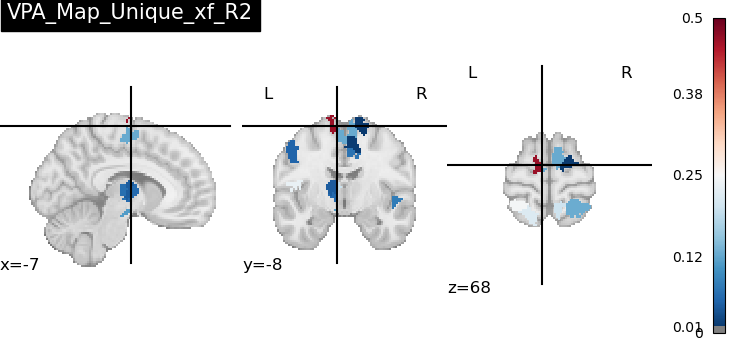
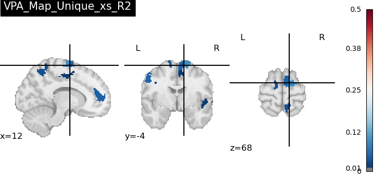
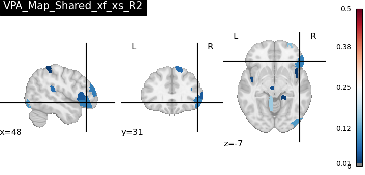
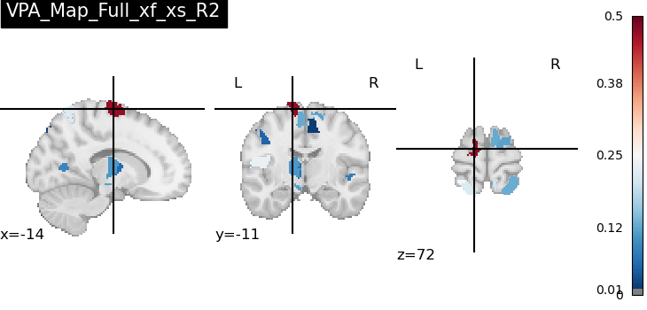

# Pilot Results: Hybrid Dynamic Neural Decoding Pipeline (N=10)

*Last updated: 2026-06-15*

This page summarizes pilot-phase results from the [Hybrid Dynamic Neural Decoding Pipeline](README.md). The primary analysis is anchored on Smith et al. (2006)'s **dual-rate motor learning model** ($x_f$, $x_s$), mapping these two behavioral state variables onto whole-brain dynamic connectivity. An earlier exploratory direction — adding a third "error" signal $e$ and a Chein & Schneider (2012) Triarchic Theory interpretation — was evaluated and **not adopted** for the main analysis (see Appendix).

**Sample**: N=10 subjects (sub-01–04, 06–11). **Status**: Phases 0A–8 complete end-to-end for the 2-variable pipeline (`codes/version_2/`, a fully self-contained pipeline).

---

## 0. Dataset and task description

This pilot uses OpenNeuro dataset [ds005598](https://openneuro.org/datasets/ds005598), a right-handed **visuomotor rotation (VMR) adaptation** task.

**What subjects did in the scanner:**
- Subjects held an MRI-compatible joystick/trackball and made center-out reaching movements toward an on-screen visual target, viewing only a cursor representing their hand position (direct hand vision occluded).
- The session began with a **resting-state scan** (eyes open, no task), used in this pipeline as each subject's individual Riemannian reference point (Phase 3).
- During the task run, after a **baseline (unrotated) block**, the visual feedback cursor was rotated **45° relative to actual hand-movement direction**, with no washout block — subjects had to adapt to and sustain the rotation for the remainder of the run, with no final de-adaptation phase.
- Each trial's **angular error** (difference between target direction and initial movement direction) is the raw behavioral measure, fed into the Smith et al. (2006) dual-rate model fit (Phase 0B) to extract the $x_f$ (fast) and $x_s$ (slow) state trajectories used throughout this report.

---

## 1. Methodology note: nested cross-validation

All variance partitioning analysis (VPA) results below use **Leave-One-Subject-Out (LOSO) cross-validation** at the outer level, and **GroupKFold (subject-grouped) cross-validation** for inner Ridge hyperparameter (alpha) selection — i.e., a fully nested subject-level LOSO. This avoids leakage that would otherwise occur from sklearn's default `RidgeCV` inner CV (leave-one-sample-out), which is biased when training samples are highly autocorrelated sliding-window connectivity features from the same subjects.

---

## 2. Group-level VPA results (481 ROIs, x_f / x_s only)

| Component | mean R² | max R² | ROIs with R² > 0 |
|---|---|---|---|
| Unique $x_f$ (fast process) | 0.0064 | 0.466 | 27 (6%) |
| Unique $x_s$ (slow process) | 0.0020 | 0.107 | 19 (4%) |
| Shared $x_f$–$x_s$ | 0.0054 | 0.200 | 37 (8%) |
| Full model ($x_f$+$x_s$) | 0.0073 | 0.470 | 31 (6%) |

**Key observations:**

- The overall R² magnitude is modest, and most ROIs (92–96%) show ~zero unique/shared variance — consistent with a conservative, leakage-free out-of-sample LOSO estimate at N=10.
- $x_f$ (fast process) shows the broadest spatial extent and highest peak R² (somatomotor cortex), consistent with the fast-adaptation process driving immediate motor-execution adjustments.
- $x_f$ and $x_s$ share a non-trivial amount of variance (37/481 ROIs), indicating partially overlapping — but not identical — neural substrates, consistent with the dual-rate model's two-state architecture.

---

## 3. Negative control: Limbic network (26 ROIs, no expected motor-learning signal)

| Component | Limbic mean R² | Whole-brain mean R² | Result |
|---|---|---|---|
| Unique $x_f$ | 0.0000 | 0.0064 | ✅ Pass |
| Unique $x_s$ | 0.0000 | 0.0020 | ✅ Pass |
| Shared $x_f$–$x_s$ | 0.0000 | 0.0054 | ✅ Pass |
| Full model | 0.0000 | 0.0073 | ✅ Pass |

**4/4 components pass cleanly** — Limbic-network R² is exactly zero for every component, while whole-brain means are all positive. This is strong evidence that the $x_f$/$x_s$-derived VPA components have genuine **spatial specificity** and are not a global artifact.

---

## 4. Anatomical localization (top-5 ROIs per component)

| Component | Top ROIs (R²) | Dominant pattern |
|---|---|---|
| Unique $x_f$ | SomMot_33 (0.466), SomMot_26, Cont_PFCl_4, SomMot_7, DorsAttn_Post_15 | **Somatomotor cortex** |
| Unique $x_s$ | Vis_9 (0.107), SomMot_35, SomMot_7, AAL3_SN_pr_L, Vis_21 | Visual + somatomotor + substantia nigra |
| Shared $x_f$–$x_s$ | SomMot_24 (0.200), Vis_30, Default_PFC_20, Cerebellum_4_5_L | **Somatomotor + cerebellum** |

All three components localize to somatomotor cortex, cerebellum (lobules IV/V), and substantia nigra — in line with the dual-rate model's anatomical predictions for motor adaptation and dopaminergic reward-based slow learning. **No component's top hits fall in thalamus or Limbic regions**, so (unlike the earlier $e$-based version) no global-signal sensitivity analysis was required.

**Group-level VPA maps** (R² thresholded at 0.01, orthogonal-slice projections; generated by `codes/version_2/run_nilearn_render.py`, Phase 8B):

| Unique $x_f$ | Unique $x_s$ |
|---|---|
|  |  |

| Shared $x_f$–$x_s$ | Full ($x_f$+$x_s$) |
|---|---|
|  |  |

Note on cut-plane selection: the orthogonal slice positions above are chosen automatically by nilearn (`plot_stat_map`'s default `cut_coords`, based on the largest suprathreshold cluster's center of mass), not the single peak-R² voxel reported in the tables above — so a given slice may not visibly pass through the exact top-ROI peak.

Note on Full vs. Shared: **Full $x_f$+$x_s$** is the total variance explained by both predictors together (≈ Unique $x_f$ + Unique $x_s$ + Shared); **Shared $x_f$–$x_s$** is only the overlapping portion — variance that either predictor could explain on its own, attributable to neither uniquely. Full closely resembles Unique $x_f$ here because $x_f$ dominates the joint model, while the Shared map is more spatially distributed across bilateral somatomotor cortex.

Interactive 3D versions of these maps (Phase 8A) can be generated locally via `codes/version_2/run_interactive_html.py`.

---

## 5. Summary vs. theoretical predictions (Smith et al. 2006)

**Hypothesized physiological substrate (why M1 / cerebellum / substantia nigra):** Smith et al. (2006), drawing on cerebellar eyeblink-conditioning work (Medina et al. 2001), proposed that the fast process ($x_f$) corresponds to cerebellar-cortex plasticity (parallel-fiber → Purkinje cell LTD, driven by climbing-fiber error signals), while the slow process ($x_s$) corresponds to a more persistent locus downstream — the deep cerebellar nuclei — that gradually consolidates the trained response (consistent with savings/long-term retention). Follow-up electrophysiology (Yang & Lisberger 2014) supports this cortex-vs-nuclei dissociation, and later work additionally implicates M1 and downstream motor output for fast online corrections (Galea et al. 2011) and dopaminergic/basal-ganglia circuits (substantia nigra) in slow, reward-based consolidation (Choi et al. 2014). This pipeline's anatomical predictions (M1 for $x_f$; cerebellar vermis/deep nuclei and substantia nigra for $x_s$) follow directly from this literature. For a fuller treatment — including alternative hypotheses (e.g., explicit/implicit dissociation, M1/parietal vs. cerebellar accounts) and caveats about the strength of these physiological inferences — see [`docs/Physiological_Mechanisms_Smith2006.md`](docs/Physiological_Mechanisms_Smith2006.md).

| Prediction | Observation | Verdict |
|---|---|---|
| $x_f$ (fast) and $x_s$ (slow) processes have distinct but partially overlapping neural substrates, localizing to M1/cerebellum | Unique $x_f$/Unique $x_s$ top hits differ (SomMot_33 vs Vis_9); Shared $x_f$–$x_s$ shows overlap (SomMot_24, Cerebellum_4_5_L) | ⚠️ Directionally consistent; not significant (see Section 6) |
| Negative control (no expected signal) should be near-zero | 4/4 components pass cleanly, Limbic R² = 0.0000 | ✅ Supported (unaffected by Section 6) |

---

## 6. Follow-up analyses: marginal R², between/within-subject decomposition, and permutation testing

Because $x_f$ and $x_s$ are themselves collinear, follow-up analyses (`run_marginal_r2_analysis.py`, `run_between_within_decomposition.py`, `run_between_subject_permutation.py`, all in `codes/version_2/`) examined each predictor's *marginal* R² and decomposed it into between-subject vs. within-subject components:

- **Marginal R² (raw)**: $x_f$ mean=0.0082/max=0.436 (top: `7Networks_LH_SomMot_33`, 28/481 ROIs nonzero); $x_s$ mean=0.0034/max=0.222 (top: `7Networks_LH_Default_PFC_20`, 22/481 ROIs nonzero). Both collapse to exactly zero after per-subject linear detrending.
- **Between-subject** (subject-mean $x_f$/$x_s$ vs. subject-mean connectivity, N=10, df=8): top-ROI |r| = 0.877 ($x_f$, `7Networks_LH_SomMot_33`, somatomotor cortex) and 0.819 ($x_s$, `7Networks_RH_Vis_9`, visual cortex), both sign-stable under leave-one-subject-out jackknife (ranges [-0.894,-0.858] and [+0.732,+0.882]). Notably, these between-subject top hits match the Unique $x_f$/Unique $x_s$ top hits in Section 4.
- **Within-subject** (subject-mean-centered): smaller but nonzero — $x_f$ mean=0.0017/max=0.052 (top: `7Networks_LH_SomMot_19`, 98/481 ROIs); $x_s$ mean=0.0022/max=0.042 (top: `7Networks_LH_Limbic_TempPole_6`, 99/481 ROIs).
- **Permutation test** (10,000 relabelings, max |r| across all 481 ROIs): the observed top |r| values (0.877 for $x_f$, 0.819 for $x_s$) are **not significant** (p = 0.2914, 0.7582). At N=10 with 481 ROIs, a max |r| of ~0.85–0.93 (95th pct of the null) is expected by chance alone.

**Bottom line**: the VPA/marginal-R² values reported in Sections 2–5 are largely driven by between-subject differences, but this between-subject effect cannot currently be distinguished from chance. The Section 2–5 numbers should be read as **candidate directions/ROIs for a higher-powered follow-up**, not as evidence in themselves.

---

## Limitations

- **N=10 is a pilot sample, and is the binding constraint on this analysis.** Section 6's permutation test points to the same conclusion: at N=10, the pipeline cannot yet distinguish signal from chance at the ROI level.

---

## Conclusion

The pipeline runs end-to-end and is **methodologically sound**: leakage-free nested LOSO-CV, a per-subject Riemannian normalization scheme, and a clean negative control (4/4 Pass, Limbic R² = 0.0000). The numerical results are **directionally consistent** with Smith et al.'s dual-rate model, identifying somatomotor cortex, cerebellum (lobules IV/V), visual cortex, and substantia nigra as candidate ROIs for follow-up. However, **no result survives appropriate statistical correction at N=10** (Section 6). This is a solid methodological pilot; the priority next step is increasing sample size.

---

## Appendix: Exploratory direction not adopted — error signal $e$ and Chein & Schneider (2012)

An earlier version of this analysis added a third behavioral regressor, $e$ (a prediction-error signal derived from the same behavioral model fit), and interpreted the resulting 7-component VPA through Chein & Schneider's (2012) Triarchic Theory (Meta/Con/Rep systems), with $e$ mapped to "Meta-cognitive monitoring." This direction is **not used in the main analysis** above, for two reasons:

1. **$e$ is mathematically near-collinear with $x_f$.** Removing $e$ from the model increased Unique $x_f$'s peak R² from 0.263 to 0.466 at the *same ROI* that was previously the top hit for Unique $e$ — i.e., $e$'s "unique" contribution largely reflected variance reallocated from $x_f$–$x_s$ shared variance, not an independent signal source.
2. **The "Meta" system is not anatomically separable from "Con" in the Schaefer 7-network atlas at this resolution** — both occupy overlapping DLPFC/ACC/insula territory (Schaefer's `Cont` and `SalVentAttn` networks), so network-level results involving $e$ cannot be uniquely attributed to "metacognitive monitoring" versus "cognitive control."

A secondary finding from this exploration: individual-subject correlations between $e$ and the fMRIPrep `global_signal` confound were strong (|r| up to 0.83) but collapsed toward zero after detrending — i.e., largely a shared low-frequency drift artifact, not trial-by-trial covariation. Controlling for global signal did not change any directional conclusion of the 7-component model. Full details, scripts, and results for this exploratory branch are preserved in `codes/version_1/`.

---

## References

- Smith, M. A., Ghazizadeh, A., & Shadmehr, R. (2006). Interacting Adaptive Processes with Different Timescales Underlie Short-Term Motor Learning. *PLoS Biology*, 4(6), e179. https://doi.org/10.1371/journal.pbio.0040179
- Chein, J. M., & Schneider, W. (2012). The Brain's Learning and Control Architecture. *Current Directions in Psychological Science*, 21(2), 78–84. https://doi.org/10.1177/0963721412437810
- Schaefer, A., Kong, R., Gordon, E. M., et al. (2018). Local-Global Parcellation of the Human Cerebral Cortex from Intrinsic Functional Connectivity MRI. *Cerebral Cortex*, 28(9), 3095–3114. https://doi.org/10.1093/cercor/bhx179
- Rolls, E. T., Huang, C.-C., Lin, C.-P., Feng, J., & Joliot, M. (2020). Automated anatomical labelling atlas 3 (AAL3). *NeuroImage*, 206, 116189. https://doi.org/10.1016/j.neuroimage.2019.116189
- Dataset: OpenNeuro [ds005598](https://openneuro.org/datasets/ds005598)
